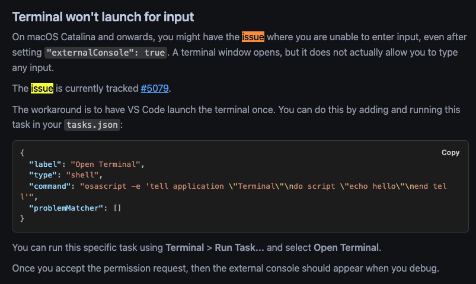

# c--exercise

## 安装 C++ 插件：

打开 VSCode，搜索并安装以下插件：

C/C++（提供代码提示和调试支持）

Code Runner（一键运行代码）

## 安装编译器：

Windows：安装 MinGW。

macOS：安装 Xcode 命令行工具（运行 xcode-select --install）。

Linux：安装 GCC（运行 sudo apt install build-essential）。

## 配置 VSCode：

创建 tasks.json 和 launch.json 文件，配置编译和调试任务（VSCode 会提供引导）。

## 问题
1. xcode-select: note: install requested for command line developer tools
  
  xcode-select --install
  sudo softwareupdate --all --install --force

2. macos 里 vscode 的集成终端无法输入
  改用外部终端
  macos 高级版本，不支持输入
  

## vscode 官方参考
1. https://code.visualstudio.com/docs/cpp/config-clang-mac